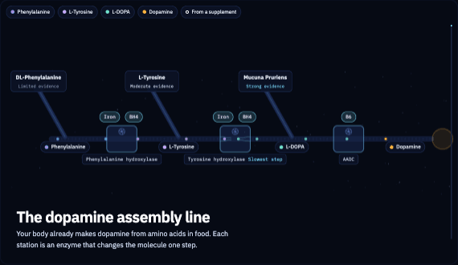
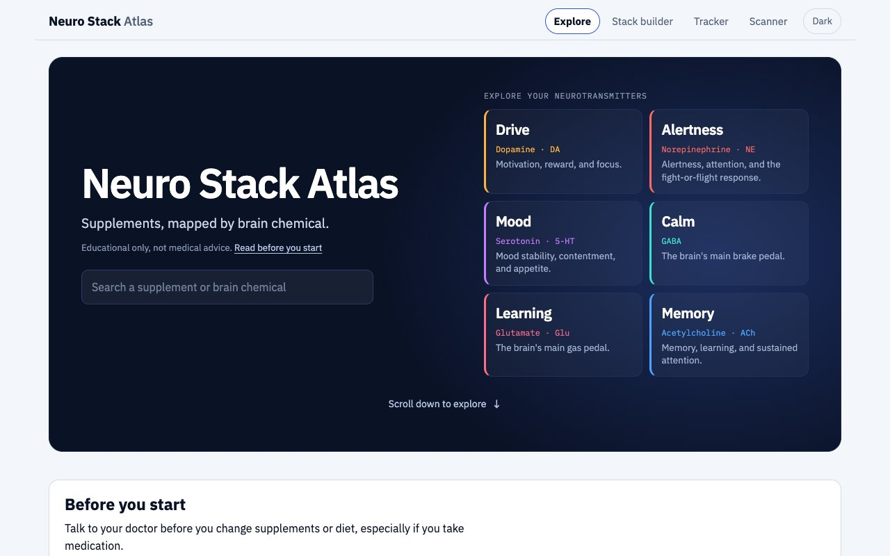
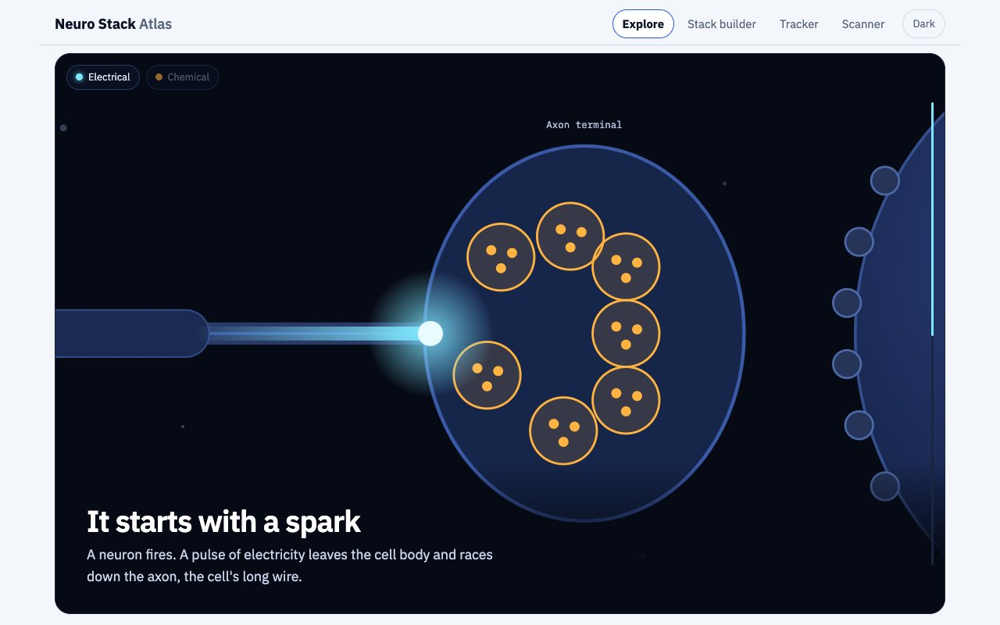
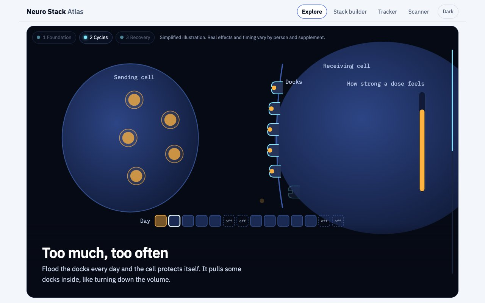
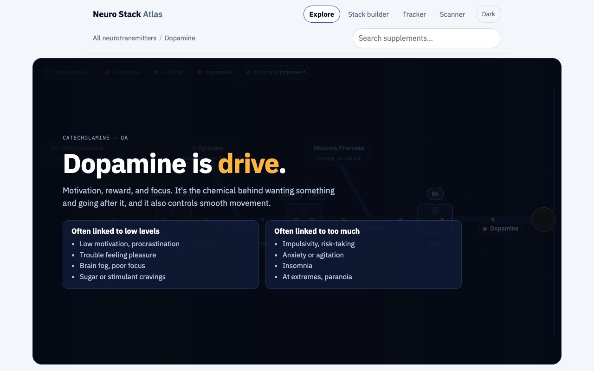
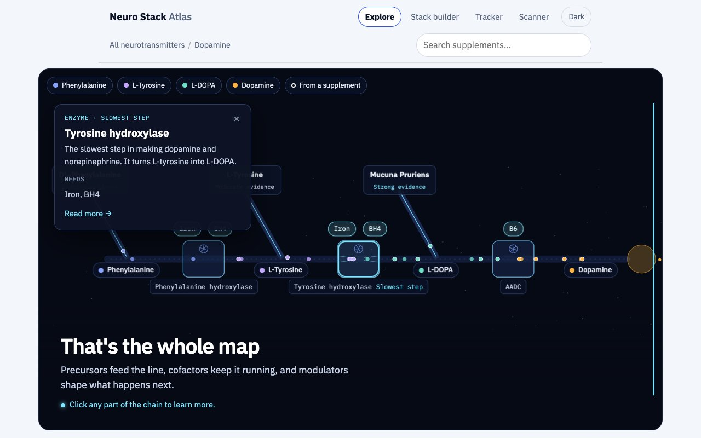
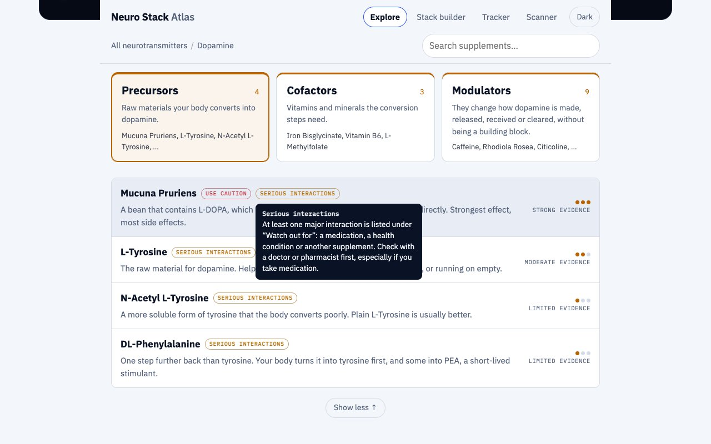
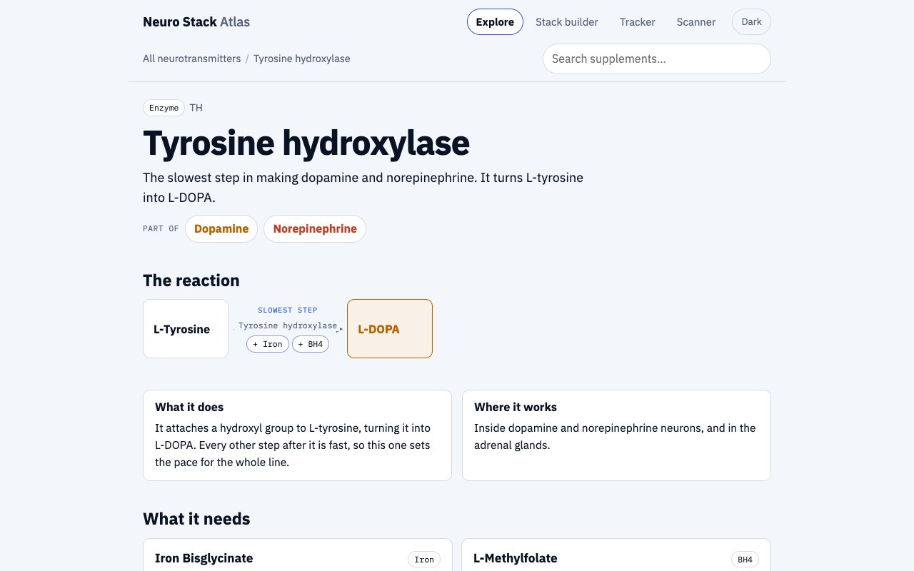
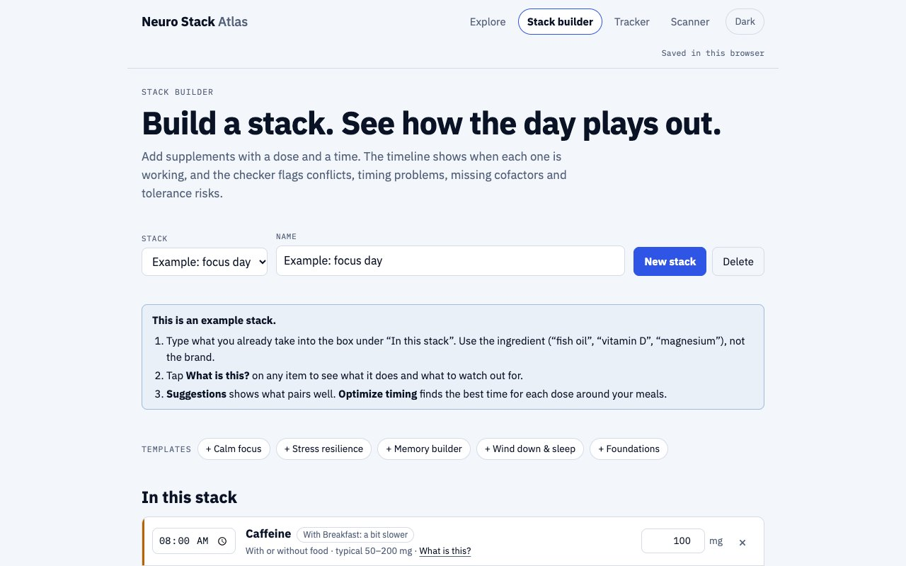
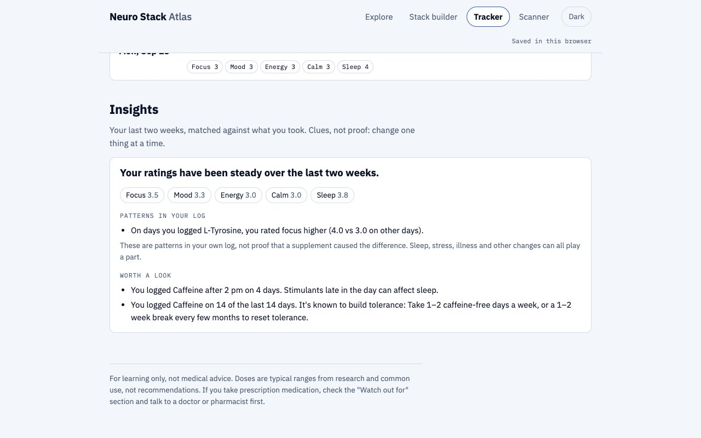

# Neuro Stack Atlas

**Supplements, mapped by brain chemical.**
A visual, evidence-rated guide to how supplements reach dopamine, serotonin, GABA, glutamate, norepinephrine and acetylcholine: which ones are raw materials, which enzymes do the work, what those enzymes need, and why some supplements are gentler than others.

**Live site:** https://el9995.github.io/neuro-stack-atlas/

> For learning only, not medical advice.



---

## What it is

Most supplement information is either marketing or a wall of studies. Neuro Stack Atlas sits in between: it explains the *mechanism* in plain language, shows how strong the evidence is, and puts safety first.

- **Learn the basics:** two scroll-driven scenes on the home page explain what neurotransmitters are, then foundation, cycling and recovery, before anyone picks a supplement.
- **Explore each neurotransmitter:** an animated assembly line built from that neurotransmitter's real pathway, with precursors, enzymes, the slowest step, cofactors and modulators. It ends on a clickable map.
- **Look up 65 supplements:** dose ranges, timing, food, tolerance, side effects, interactions and mechanism, each with an evidence rating.
- **Go deeper on 10 enzymes:** what each one does, what it needs and what controls its speed.
- **Plan and track:** a Stack builder with a day timeline and an interaction/timing checker, and a Tracker that shows patterns in your own log.

| | |
|---|---|
|  |  |
|  |  |
|  |  |
|  |  |
|  | |

## Key product decisions

- **Evidence ratings everywhere.** Every supplement-to-neurotransmitter link is rated *strong*, *moderate*, *limited* or *theoretical*. Lists are sorted by evidence, and weaker findings (animal studies, early data) are labeled as such.
- **Teach the mechanism, not just the outcome.** The assembly line shows *where* each supplement joins: precursors before the slowest step (like L-tyrosine) are gentler, because the body still sets the pace; anything after it (like L-DOPA from Mucuna) skips that brake.
- **Cofactors are first-class.** Enzymes don't run without vitamins and minerals (iron, B6, vitamin C, copper…). The site shows which enzyme needs which cofactor, and the Stack builder suggests missing ones.
- **Foundation before hacking.** The home page teaches foundation, cycling and recovery *before* it hands over the neurotransmitter pages.
- **No medical claims.** Disclaimers sit near the top of the home page ("talk to your doctor"). Supplements with serious risks or major interactions carry tags that explain themselves on hover. The Tracker never says a supplement *caused* anything: it reports patterns ("on days you logged X, you rated Y higher"), needs 10+ logged days before linking a supplement to a change, and shows a safety message with a crisis line when mood stays low.
- **Plain language up front, depth on demand.** The home page avoids jargon; enzyme pages and info cards go deeper for people who want it.
- **Private by default.** No accounts and no server: stacks and tracker logs stay in the visitor's own browser.

## How it's built

- **Plain HTML, CSS and JavaScript.** No framework and no build step; GitHub Pages serves the files as they are.
- **Scroll-driven SVG scenes.** Each scene maps scroll position to a camera and to animation states, so it plays at the reader's pace. The assembly line lays itself out from each neurotransmitter's pathway data, so all six pages share one scene.
- **Content separate from code.** All the data and wording lives in [`content/`](content/) as clearly labeled files, with editing notes, so it can be edited without touching code ([guide](content/README.md)).
- **Review loop.** [`tools/`](tools/) holds the scripts used to review every change: repeatable screenshots at desktop and phone sizes (headless Chrome with a frozen clock), a before/after comparison page, a content diff, and a click-through test.
- **Deployment.** A GitHub Actions workflow publishes only the site files to GitHub Pages on every push to `main`.

```
index.html        page shell
css/              theme tokens + styles by area
js/               router, pages, scroll scenes, stack builder, tracker, scanner
content/          data and wording (supplements, pathways, captions, enzymes)
tools/            review tooling (screenshots, comparison, tests)
baseline/         the original single-file prototype, kept for comparison
docs/images/      README images
```

To run it locally:

```bash
python3 -m http.server 8003
```

Then open http://localhost:8003.

## How it was made

This project was **built with AI under my direction.** It started as a single-file prototype in a claude.ai artifact. I then worked with Claude (Anthropic's AI coding assistant) to turn it into a maintainable project and develop it further. Claude wrote the code. I set the product direction and priorities, made the content and safety decisions, and reviewed every change through before/after screenshots before it was saved.

The git history shows the path: the original one-file prototype, the mechanical split into a static project (verified identical to the original), then each round of product changes.

## Status

- Desktop first; a mobile layout pass is planned.
- The Scanner runs in basic mode on this site (paste the label text). Photo scanning only works inside claude.ai.
- Next: a logo, a guided walkthrough of the Stack builder and Tracker, and reflex games to measure how a stack affects you.
